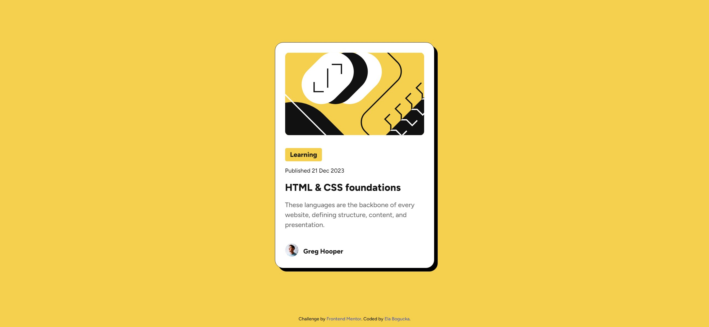

# Frontend Mentor - Blog preview card solution

This is a solution to the [Blog preview card challenge on Frontend Mentor](https://www.frontendmentor.io/challenges/blog-preview-card-ckPaj01IcS).

## Table of contents

- [Overview](#overview)
  - [The challenge](#the-challenge)
  - [Screenshot](#screenshot)
  - [Links](#links)
- [My process](#my-process)
  - [Built with](#built-with)
  - [What I learned](#what-i-learned)
  - [Useful resources](#useful-resources)
- [Author](#author)

## Overview

### The challenge

Users should be able to:

- See hover and focus states for all interactive elements on the page

### Screenshot



### Links

- Solution URL: [https://www.frontendmentor.io/solutions/solution-using-flexbox-3YDpE1mtoN](https://www.frontendmentor.io/solutions/solution-using-flexbox-3YDpE1mtoN)
- Live Site URL: [https://ebogucka.github.io/blog-preview-card/](https://ebogucka.github.io/blog-preview-card/)

## My process

### Built with

- Semantic HTML5 markup
- CSS custom properties
- Flexbox
- Mobile-first workflow

### What I learned

I learned how to scale the font size with the browser size using CSS `clamp()`, for example:

```css
h1 {
    /* 22px - 24px */
    font-size: clamp(1.375rem, 1.3393rem + 0.1786vw, 1.5rem);
}
```

### Useful resources

- [CSS Clamp(): The Responsive Combination We’ve All Been Waiting For](https://blog.bitsrc.io/css-clamp-the-responsive-combination-weve-all-been-waiting-for-f1ce1981ea6e) - This helped me understand how to use `clamp()`
- [Font-size Clamp Generator](https://clamp.font-size.app) - This allows you to generate the preferred font size when using `clamp()`


## Author

- Website - [StronaFirmy.pl](https://stronafirmy.pl)
- Frontend Mentor - [@ebogucka](https://www.frontendmentor.io/profile/ebogucka)
